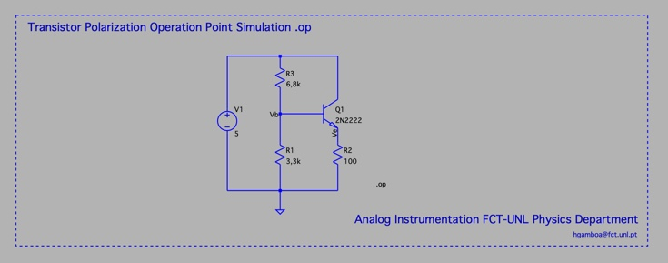

# Guide 1 - Intro to LTspice

## Pre requeirments 

1. Install [ltspice]( https://www.analog.com/en/design-center/design-tools-and-calculators/ltspice-simulator.html )

1. Print shortcuts:
  - for MAC [link](https://www.analog.com/media/en/simulation-models/spice-models/LTspiceShortcutsForMacOSX.pdf)
  - for windows [link](https://www.analog.com/media/en/simulation-models/spice-models/LTspice_ShortcutFlyer.pdf)


## Goals

1. Learn how to design a simple circuit in LTSpice
2. Generate a DC simulation and validate with your assumptions


## Tasks

### Task 1  - .op Directive

1. Draw the second stage of the Coolpits Oscilator 
   1. Introduce each of the components (R, C, Voltage source)
   1. Introduce the specific values to each component
   1. Add NPN transistor and the select the type to be 2N2222
   1. Add a ground 
   1. Connect the circut with wires
   1. Add labels to a net points (Vb and Ve)
   1. Add a .op spice directive
2. Compute the expected value for Vb and Ve 
3. Execute a DC simulation and check the spice output

The diagram is the following:




The simulation is made by introducing a spice directive 

```
.op
```

Then check spice error log and verify V(Vb) and V(Ve), compare with your  expected results.

### Task 2 - .step directive 

1. Change the value of R2 to {R}
2. Change the spice directive to 

```
.step param R 100 10k 100
.op
```

3. Run simulation and use the scope to observe Vb and Ic


