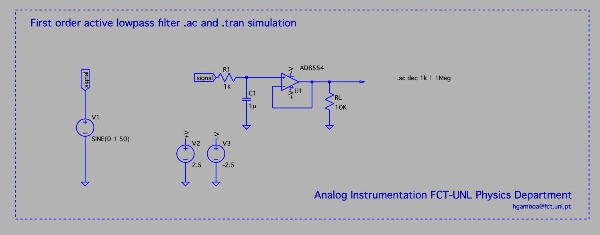
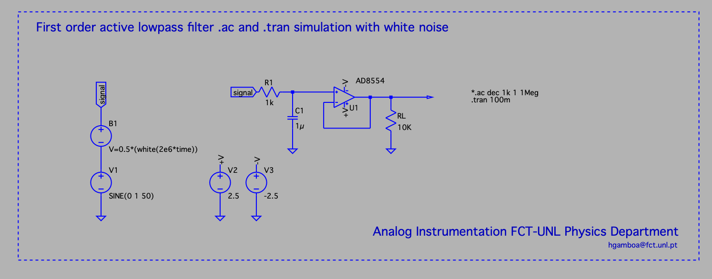
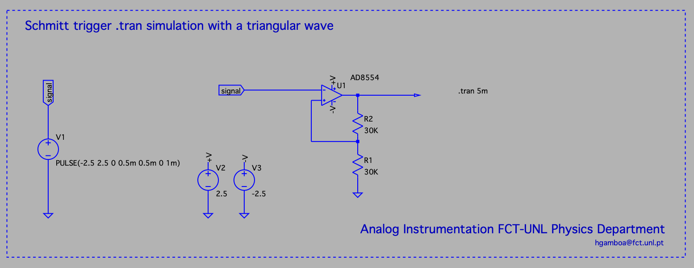
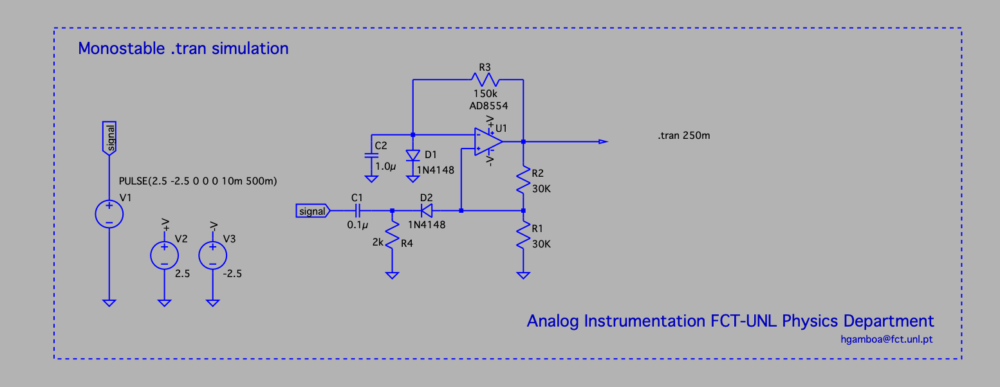

# Guide 2 - OpAmp Simulation with .ac and .tran directives

## Goals

1. Learn how to analyse analog filters in the frequency domain with small  alternate current analisys (.ac) simulation mode.
2. Evaluate the introduction of noise in a first order low pass circut with a transient simulation (.tran), using a B1 source.
3. Study a monostable impulse generation circuit. 

## Tasks

### Task 1  - .ac directive

1. Draw a fist order active filter based on an OpAmp in non-inverting montage
   1. Introduce the signal source (V1)and label as signal with a sine function with 0V in DC, an amplitude of 1V and a base frequency of 50HZ: SINE(0 1 50) 
   1. Create two symetric sources of 2.5 (V2) and -2.5 (V3), and label as V+ and V-
   1. Introduce an OpAmp (AD8554) and connect the power inputs.
   1. Introduce an R (1kOhm) and C (1uF), grounds and the loop connection on the negative terminal of the OpAmp as in diagram 1. 
   1. Add a load resistance (RL = 10kOhm)
   1. Add groud net points where needed.
   1. Add a .ac spice directive to create 1000 points in logarithmic scale from 1Hz to 1MHz (.ac dec 1k 1 1Meg)
2. Compute the expected cut frequency (Fc = 1/(2*pi*R*C)) 
3. Check in the Bode diagram of the output signal what is the attenuation at the Fc frequency. 

The diagram is the following:

### Task 2 - .tran directive 

1. Change the diagram by adding a noise source 
    1. Add a new voltage source in series with V1, named B1 with white noise V=0.5*(white(2e6*time)).
    1. Add a .tran directive to study the transient time since  0s until 100ms (.tran 100m). 
    1. Comment the .ac directive
    1. Change the frequency of V1 to Fc.
    1. Observe the signal source V1 and the output signal.
    1. Verify the attenuation and compare with the observed value of the Bode diagram. 
    1. Change the frequency to 10*Fc and verify the signal amplitude.
    1. Validate the impact of the noise for different frequencies. 
1. Compare the observed values with the transfer function of a low pass filter: |G(F)| = 1/sqrt(1 + (F/Fc)^2) 

The diagram is the following:

### Task 3. - .tran directive to study a monostable 

1. Implement a Schmitt Trigger Comparator as in the following diagram. (Follow this [link](https://www.electronics-tutorials.ws/opamp/op-amp-multivibrator.html) for extended analysis)
    1. To reuse the previous diagram the OpAmp it is needed to rotate and mirror the component, given that the feedback is in the positive input.
    1. Place a triangular wave as input based on a PULSE wave definition (PULSE (Voff Von Tdelay Trise Ton Tperiod Ncycles) - PULSE(-2.5 2.5 0 0.5m 0.5m 0 1m) )
    1. Use the transient spice directive to observe 5 cycles (.tran 5m)
    1. Compute beta = R1/(R1 + R2) and compare the thresholds with beta * V+ and beta * V-.
    
The diagram is the following:

1. Change the previous circuit to create an input trigger and delay mechanism to create a monostable circuit. 

    1. Create a negative pulse (PULSE 2.5 -2.5 0 0 0 10m 500m)
    1. Change the schematic following the next diagram.
    1. Measure the output impulse duration and compare with T = R3*C2*ln((1+R1/R2)) (Check this [link](https://www.electronics-tutorials.ws/opamp/op-amp-monostable.html)
    
    
The diagram is the following:

Check other options to create a monostable with the 555 circuit or with a pair of transistors. 

